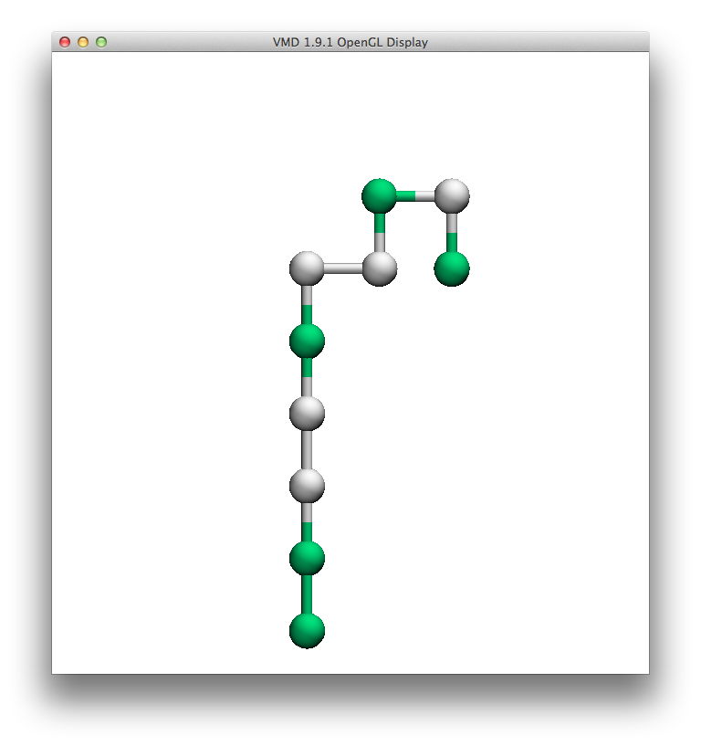

.. _article2:

====================================
 Visualizing HP Trajectories in VMD
====================================

Output from HPlattice simulations can be easily viewed using the `VMD molecular graphics program <http://www.ks.uiuc.edu/Research/vmd/>`. HPlattice trajectories are saved as xyz coordinate files, which can be loaded by VMD.

To facilitate visualization of the lattice models, HPlattice includes a .vmdrc file. If you copy this file to your home directory and save it as ``.vmdrc``, then VMD should automatically apply the styles to any HPlattice .xyz trajectories that you load from the command line.

To call VMD from the command line, create a link to the VMD binary. On a mac, the command would be:

.. code-block:: bash

    ln -s /Applications/VMD\ 1.9.1.app/Contents/vmd/vmd_MACOSXX86 /usr/local/bin/vmd

Then, if the .vmdrc file is in your home directory, this command would open an HPlattice trajectory in VMD and apply the HPlattice style by default:

.. code-block:: bash

    vmd trajectory.xyz

Which should produce a chain that looks like this:

Sometimes VMD draws the topology of the chain incorrectly. In that case, the easiest way to correct it is to enter these commands on the Tk console:

.. code-block:: bash

    topo getbondlist
    topo setbondlist {{0 1} {1 2} {2 3} {3 4} {4 5} {5 6} {6 7} {7 8} {8 9}}

You'll need to adjust the second command to match the length of your chain. The last pair should be ``{N-2 N-1}``, where N is the length of the chain.
